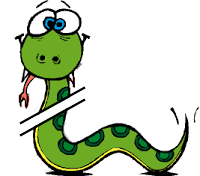
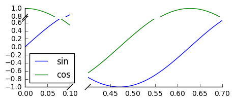
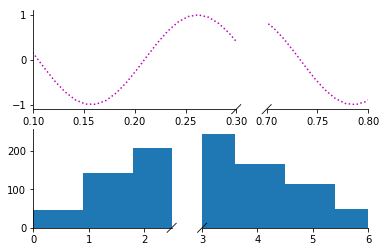

# brokenaxes



brokenaxes makes matplotlib plots with breaks in the axes for showing data across a discontinuous range.

[](https://pypi.python.org/pypi/brokenaxes)

## Installation
```
pip install brokenaxes
```

## Usage
```python
import matplotlib.pyplot as plt
from brokenaxes import brokenaxes
import numpy as np

fig = plt.figure(figsize=(5,2))
bax = brokenaxes(xlims=((0, .1), (.4, .7)), ylims=((-1, .7), (.79, 1)), hspace=.05)
x = np.linspace(0, 1, 100)
bax.plot(x, np.sin(10 * x), label='sin')
bax.plot(x, np.cos(10 * x), label='cos')
bax.legend(loc=3)
bax.set_xlabel('time')
bax.set_ylabel('value')
```


Create subplots:

```python
from brokenaxes import brokenaxes
from matplotlib.gridspec import GridSpec
import numpy as np

sps1, sps2 = GridSpec(2,1)

bax = brokenaxes(xlims=((.1, .3),(.7, .8)), subplot_spec=sps1)
x = np.linspace(0, 1, 100)
bax.plot(x, np.sin(x*30), ls=':', color='m')

x = np.random.poisson(3, 1000)
bax = brokenaxes(xlims=((0, 2.5), (3, 6)), subplot_spec=sps2)
bax.hist(x, histtype='bar')
```


### Features:
* Break x and y axes.
* Supports multiple breaks on a single axis.
* Automatically scales axes according to relative ranges.
* Plot multiple lines.
* Legend with positioning relative to entire broken axes object
* x and y label centered to entire plot
* Make brokenaxes object a subplot itself with `matplotlib.GridSpec.subplot_spec`.

### Advice
Please use this tool wisely. Any data visaulization techique can be used to elucidate trends in the data, and can be used to manipulate and mislead. The latter is particularly true for broken axes plots, so please try to use them responsibly.
